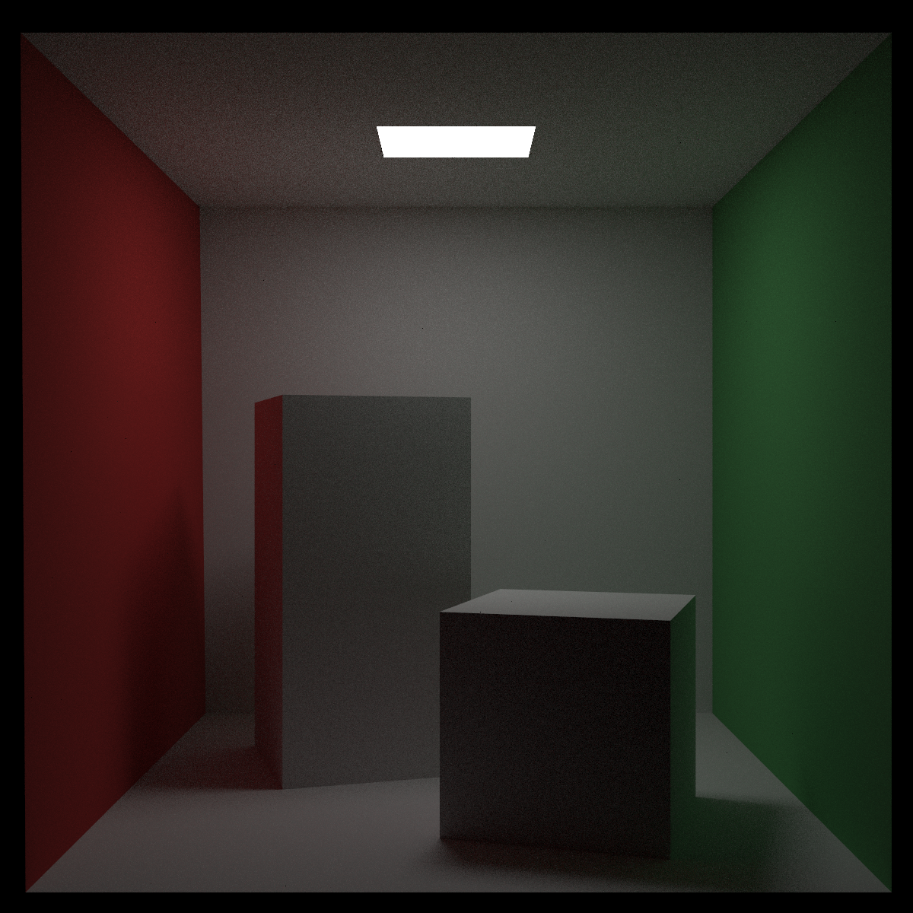
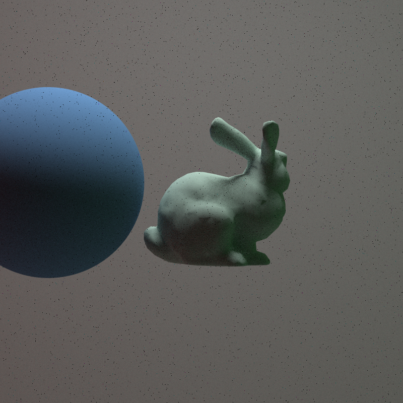
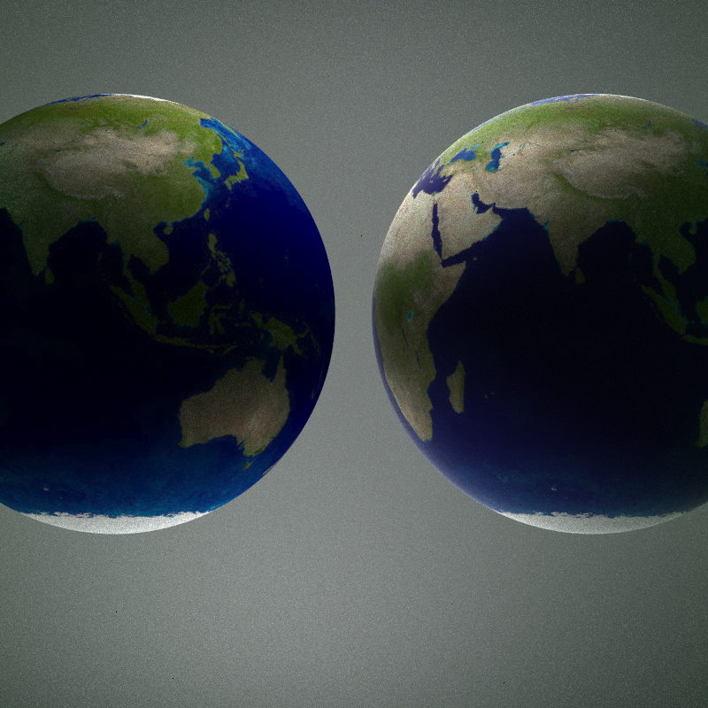

## Todo

- [ ] The Kulla-Conty Approximation

## 特性

渲染文件表现为一个 json 文件，测试场景位于 scenes 文件夹中。json 解析库使用的是 [GitHub - nlohmann/json: JSON for Modern C++](https://github.com/nlohmann/json)。 

渲染文件格式示例如下：
```json
{
    "screen": {
        "width": 800,
        "aspect_ratio": 1.0
    },
    "camera": {
        "lookfrom": [
            278.0,
            278.0,
            -800.0
        ],
        "lookat": [
            278.0,
            278.0,
            0.0
        ],
        "vup": [
            0.0,
            1.0,
            0.0
        ],
        "vfov": 40.0,
        "aperture": 0.0,
        "focus_dist": 1.0
    },
    "render_parameters": {
        "samples_per_pixel": 8,
        "raytraer_depth": 3,
        "background": [
            0.0,
            0.0,
            0.0
        ]
    },
    "scene": {
        "objs": [
            {
                "obj_path": "floor.obj",
                "material": {
                    "material_type": "Lambertian",
                    "albedo": {
                        "texture_type": "Solid_Texture",
                        "color": [
                            0.73,
                            0.73,
                            0.73
                        ]
                    }
                }
            },
            {
                "obj_path": "left.obj",
                "material": {
                    "material_type": "Lambertian",
                    "albedo": {
                        "texture_type": "Solid_Texture",
                        "color": [
                            0.65,
                            0.05,
                            0.05
                        ]
                    }
                }
            },
            {
                "obj_path": "right.obj",
                "material": {
                    "material_type": "Lambertian",
                    "albedo": {
                        "texture_type": "Solid_Texture",
                        "color": [
                            0.12,
                            0.45,
                            0.15
                        ]
                    } 
                }
            },
            {
                "obj_path": "shortbox.obj",
                "material": {
                    "material_type": "Lambertian",
                    "albedo": {
                        "texture_type": "Solid_Texture",
                        "color": [
                            0.73,
                            0.73,
                            0.73
                        ]
                    }
                }
            },
            {
                "obj_path": "tallbox.obj",
                "material": {
                    "material_type": "Lambertian",
                    "albedo": {
                        "texture_type": "Solid_Texture",
                        "color": [
                            0.73,
                            0.73,
                            0.73
                        ]
                    }
                }
            },
            {
                "obj_path": "light.obj",
                "material": {
                    "material_type": "Diffuse_light",
                    "emit": {
                        "texture_type": "Solid_Texture",
                        "color": [
                            15.0,
                            15.0,
                            15.0
                        ]
                    }
                }
            }
        ]
    }
}
```

上述文件渲染结果如下：


目前支持的特性包括：
1. 基本的相机与坐标变换系统。
2. 支持 OBJ 模型的加载和纹理贴图的导入。
3. 支持球，三角形网格等多种几何体。
4. 支持 Microfacet Model。
5. 支持重要性采样的 Path Tracing 算法。

部分结果展示：



